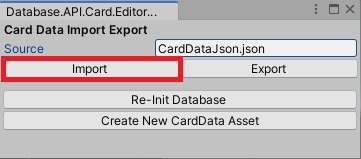
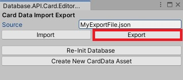

# chenostrovski_card_database_exc_v1_2_readme

Mobile Game Developer Home Exercise.

## Running the application

#### :exclamation: Make sure to switch API Compatibility Level to .NET 4.x 

    This can be done via Unity;
    Edit -> Project Settings -> Player -> Other settings -> API Compatibility Level

##### Note: 
    Unity version used to develop the project: 2019.3.4f1

## Implementation

### Part 1
- Added a new abstract class `FileType` to start a fresh 'pathway' for file processing and keeping other classes clean.  
  In addition, I created a factory (following the design pattern) class `FileFactory` for this object;  
  allowing a structured approach for handling specific file types (JSON/XML) and future flexibility (extending for YAML support).
- `ModelTransformer` - Since I don't want to be instantiating `ScriptableObjects` like `CardData` myself,   
  This abstract class will hold Deserialization logic into **my own models** that correspond to the external data files.  
  The Serialization specifics are also kept inside of this class (For example, for XML export I decided to serialize to JSON first).  
  This leaves our `Import()/Export()` methods with a single responsibility of creating a new asset or writing to a target file, respectively.  
- `ExtraDataConverter` - Helper class that dynamically creates an `ExtraData` instance based on the type attribute.

**Notes**: 
- As for extending file type support, a new developer on the project will need to create a new `ModelTransformer`  
  that inherits from this class and implements the abstract `Transform()/Serialize()` methods  
  (`YamlModelTransformer`, for example).  
  Of course it would also be necessary to create a new `FileType` that will be available to get from the factory.  
  More info is available in code documentation.
- `ExtraDataConverter` - prior to writing this, my original attempt was to create a custom [`JsonConverter`](https://www.newtonsoft.com/json/help/html/CustomJsonConverter.htm),  
  which failed due to [`.Populate()`](https://www.newtonsoft.com/json/help/html/M_Newtonsoft_Json_JsonSerializer_Populate.htm) not being able to do it's thing with setter-less properties (`MinionExtraData.Health`, for example).

 

### Part 2
- `GameManager` is a singleton exclusively responsible for fetching data from the DB.
- Hope it's OK, I took design inspiration from 'Coin Master' (Cards shape similar to 'Buy Coin/Spins' menu + cloud background from 'Play').

## Unit Tests

I have added several unit tests which cover basic functionality at `Assets/Tests`.  
It was fun to see them pass. :laughing:
